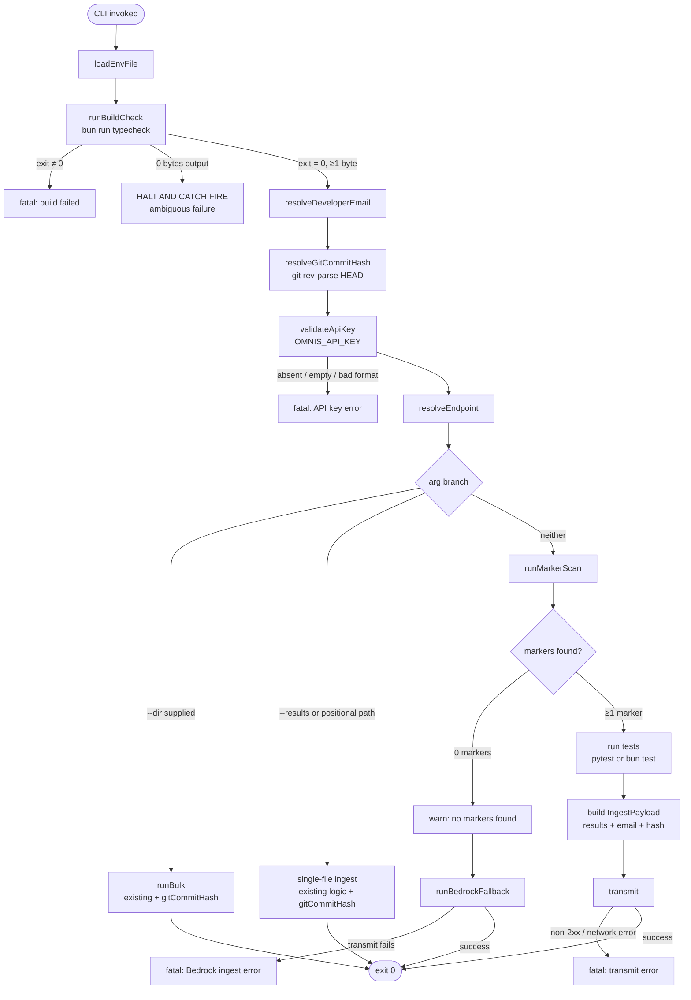

# Design Document — Smart Ingestion Hierarchy

## Overview

This design refactors `omnis-cli/index.ts` to implement a three-tier, priority-ordered evidence ingestion strategy. All changes are confined to that single file.

**Before:** the CLI required a pre-built JSON results file (`--results` or a positional path). Every invocation was a manual, operator-driven push.

**After:** the CLI can autonomously discover requirement annotations in source code, run the associated tests, and transmit a payload. If no annotations exist it falls back to Bedrock AI auto-ingestion. Manual results-file override remains fully supported. Two cross-cutting concerns are added: a mandatory build/type-check gate before any ingestion executes, and a `git_commit_hash` field carried on every outbound payload.

### Key Design Decisions

- **`spawnSync` throughout** — consistent with the existing pattern; avoids async complexity for subprocess management and aligns with the HALT AND CATCH FIRE protocol that must stop the process synchronously on 0-byte output.
- **No new dependencies** — `fs`, `path`, `child_process`, `chalk` only. The recursive file scan is written against `readdirSync` directly.
- **Regex-only marker extraction** — no AST, no glob libs, no parsing libraries. The two annotation patterns are simple enough that a single `RegExp.exec` loop per file suffices.
- **`runBulk` stays non-recursive** — the existing bulk mode scans only the top-level directory; this is preserved. The new marker scanner is a separate function with its own recursive traversal.

---

## Architecture

### Control Flow — `run()` (Refactored)



### Priority Hierarchy

| Priority | Mode | Trigger |
|----------|------|---------|
| Override | `--results` / positional path | Explicit file path supplied |
| Override | `--dir` | Directory path supplied |
| 1 | Marker Scan | Neither `--results` nor `--dir` supplied; annotations found |
| 2 | Bedrock Auto-Ingest | Neither flag supplied; zero annotations found |

The two overrides bypass the hierarchy entirely. The build check and API key validation always execute regardless of mode.

---

## Components and Interfaces

### Modified Interface: `CliArgs`

```typescript
interface CliArgs {
  resultsPath:      string | undefined;   // optional — hierarchy mode when absent
  dirPath:          string | undefined;
  srcDir:           string;               // NEW — default "."
  concurrency:      number;
  executionStatus:  string | undefined;
  endpointOverride: string | undefined;
  envFile:          string;
}
```

`resultsPath` is now optional. When neither `resultsPath` nor `dirPath` is set, the hierarchy activates. `srcDir` defaults to `"."` and is set by `--src-dir <path>`.

### Modified Interface: `IngestPayload`

```typescript
interface IngestPayload {
  results:           unknown;
  execution_status?: string;
  developer_email?:  string | null;
  git_commit_hash:   string | null;       // NEW — always populated
}
```

### New Function: `runBuildCheck()`

```typescript
function runBuildCheck(): void
```

Executes `bun run typecheck` via `spawnSync`. Combines stdout and stderr before measuring length.

- **Timeout:** 60 000 ms
- **0-byte output:** HALT AND CATCH FIRE — `fatal()` with diagnostic message
- **Non-zero exit:** `fatal()` — prints captured output then exits
- **Exit 0, ≥1 byte:** returns normally; CLI proceeds

```typescript
function runBuildCheck(): void {
  const result = spawnSync("bun", ["run", "typecheck"], {
    encoding: "utf8",
    timeout: 60_000,
    windowsHide: true,
  });

  const combined = (result.stdout ?? "") + (result.stderr ?? "");

  if (combined.length === 0) {
    // HALT AND CATCH FIRE
    fatal(
      "Build check produced zero bytes of output (ambiguous failure).\n" +
      "  Cannot verify type safety. Ingestion aborted per HALT AND CATCH FIRE protocol."
    );
  }

  if (result.status !== 0) {
    console.error(chalk.red("\n[omnis] Build check failed:"));
    console.error(combined);
    fatal("Type check failed — fix all errors before ingesting evidence.");
  }

  console.log(chalk.dim("[omnis] Build check passed."));
}
```

### New Function: `resolveGitCommitHash()`

```typescript
function resolveGitCommitHash(): string
```

Executes `git rev-parse HEAD` via `spawnSync`.

- **Timeout:** 3 000 ms
- **Success:** trims whitespace from stdout, returns SHA-1 string
- **Any failure** (non-zero exit, empty output, spawnSync throws): returns `"unknown_commit"`, logs dim notice

```typescript
function resolveGitCommitHash(): string {
  try {
    const result = spawnSync("git", ["rev-parse", "HEAD"], {
      encoding: "utf8",
      timeout: 3_000,
      windowsHide: true,
    });
    if (result.status === 0 && result.stdout) {
      const hash = result.stdout.trim();
      if (hash) return hash;
    }
    console.log(chalk.dim(
      "[omnis] git rev-parse HEAD failed or returned empty — using 'unknown_commit'."
    ));
  } catch {
    console.log(chalk.dim(
      "[omnis] git rev-parse HEAD threw — using 'unknown_commit'."
    ));
  }
  return "unknown_commit";
}
```

### New Function: `scanForMarkers(srcDir: string): string[]`

```typescript
function scanForMarkers(srcDir: string): string[]
```

Recursively traverses `srcDir` using `readdirSync`. Collects all `.py`, `.ts`, `.js` files. Applies regex extraction to each file's UTF-8 content. Returns a deduplicated array of `Req_ID` strings.

**No third-party file-glob library.** Pure `fs.readdirSync` + `fs.statSync`.

**Regex patterns:**

| Language | Pattern | Regex |
|----------|---------|-------|
| Python (`.py`) | `@pytest.mark.requirement("REQ_ID")` | `/\@pytest\.mark\.requirement\(\s*["']([^"']+)["']\s*\)/g` |
| JS/TS (`.ts`, `.js`) | `// @req: REQ_ID` | `/\/\/\s*@req:\s*(\S+)/g` |

The Python regex accepts both single and double quotes to be robust against formatting variations. The JS/TS regex captures the first non-whitespace token after `@req:`, consistent with how the existing annotation format is described.

```typescript
function scanForMarkers(srcDir: string): string[] {
  const absDir = resolve(srcDir);
  if (!existsSync(absDir)) {
    fatal(`Source directory not found: ${absDir}`);
  }

  const PY_RE  = /@pytest\.mark\.requirement\(\s*["']([^"']+)["']\s*\)/g;
  const REQ_RE = /\/\/\s*@req:\s*(\S+)/g;

  const found = new Set<string>();

  function walk(dir: string): void {
    const entries = readdirSync(dir, { withFileTypes: true });
    for (const entry of entries) {
      const fullPath = resolve(dir, entry.name);
      if (entry.isDirectory()) {
        walk(fullPath);
      } else if (entry.isFile()) {
        const ext = entry.name.split(".").pop()?.toLowerCase();
        if (!ext || !["py", "ts", "js"].includes(ext)) continue;
        const content = readFileSync(fullPath, "utf8");
        const re = ext === "py" ? PY_RE : REQ_RE;
        re.lastIndex = 0;
        let m: RegExpExecArray | null;
        while ((m = re.exec(content)) !== null) {
          found.add(m[1]);
        }
      }
    }
  }

  walk(absDir);
  return Array.from(found);
}
```

### New Function: `runMarkerScan(...)`

```typescript
function runMarkerScan(
  srcDir:          string,
  endpoint:        string,
  apiKey:          string,
  executionStatus: string | undefined,
  developerEmail:  string,
  gitCommitHash:   string,
): Promise<boolean>
```

Orchestrates the full Priority 1 path:

1. Call `scanForMarkers(srcDir)`
2. If 0 markers → `console.warn`, return `false` (caller activates Bedrock fallback)
3. Detect test runner language from file extensions of annotated files (`.py` → pytest, `.ts`/`.js` → bun test)
4. Run tests via `spawnSync`; capture combined output
5. Build `IngestPayload` with captured output as `results`
6. Call `transmit(endpoint, apiKey, payload)` — `transmit` already calls `fatal()` on non-2xx
7. Return `true`

### New Function: `runBedrockFallback(...)`

```typescript
async function runBedrockFallback(
  endpoint:      string,
  apiKey:        string,
  developerEmail: string,
  gitCommitHash:  string,
): Promise<void>
```

Transmits a minimal payload with `execution_status: "BEDROCK_AUTO_INGEST"`. Includes `developer_email` and `git_commit_hash`. Uses `transmit()` which calls `fatal()` on any failure.

```typescript
async function runBedrockFallback(
  endpoint: string,
  apiKey: string,
  developerEmail: string,
  gitCommitHash: string,
): Promise<void> {
  console.log(chalk.yellow(
    "[omnis] No requirement markers found. Activating Bedrock Auto-Ingest fallback."
  ));
  const payload: IngestPayload = {
    results: null,
    execution_status: "BEDROCK_AUTO_INGEST",
    developer_email: developerEmail,
    git_commit_hash: gitCommitHash,
  };
  await transmit(endpoint, apiKey, payload);
}
```

### Modified Function: `runBulk(...)`

Adds `gitCommitHash: string` parameter. Every per-file `IngestPayload` construction gains `git_commit_hash: gitCommitHash`.

```typescript
async function runBulk(
  dirPath:       string,
  endpoint:      string,
  apiKey:        string,
  args:          CliArgs,
  developerEmail: string,
  gitCommitHash:  string,   // NEW
): Promise<void>
```

### Modified Function: `parseArgs()`

- `--results` and positional path become optional (no longer `fatal()` when neither is supplied)
- Adds `--src-dir <path>` flag parsing, default `"."`
- Removes the `fatal()` call that previously required `resultsPath || dirPath`
- Retains mutual exclusion between `--results` and `--dir`

### Refactored Function: `run()`

New control flow:

```typescript
async function run(): Promise<void> {
  const args = parseArgs(process.argv);
  loadEnvFile(args.envFile);

  // 1. Build gate — always first
  runBuildCheck();

  // 2. Identity resolution
  const developerEmail = resolveDeveloperEmail();
  const gitCommitHash  = resolveGitCommitHash();

  // 3. API key validation
  const apiKey = process.env.OMNIS_API_KEY;
  // ... validation unchanged ...

  // 4. Endpoint resolution
  const endpoint = args.endpointOverride
    ?? process.env.OMNIS_API_ENDPOINT
    ?? DEFAULT_ENDPOINT;

  // 5. Mode branch
  if (args.dirPath) {
    await runBulk(args.dirPath, endpoint, apiKey!, args, developerEmail, gitCommitHash);
    return;
  }

  if (args.resultsPath) {
    // Single-file path (unchanged logic + gitCommitHash in payload)
    return;
  }

  // Hierarchy mode
  const markerHit = await runMarkerScan(
    args.srcDir, endpoint, apiKey!, args.executionStatus,
    developerEmail, gitCommitHash,
  );
  if (!markerHit) {
    await runBedrockFallback(endpoint, apiKey!, developerEmail, gitCommitHash);
  }
}
```

---

## Data Models

### `IngestPayload` — Updated

```typescript
interface IngestPayload {
  results:           unknown;        // test output JSON or null (Bedrock path)
  execution_status?: string;         // "PASS" | "FAIL" | "BEDROCK_AUTO_INGEST" | custom
  developer_email?:  string | null;  // from git config or env; nullable
  git_commit_hash:   string | null;  // SHA-1 from git rev-parse HEAD; "unknown_commit" on failure
}
```

### Git Commit Hash Data Flow

```
resolveGitCommitHash()
   └─ spawnSync("git", ["rev-parse", "HEAD"], { timeout: 3000 })
         ├─ success, non-empty stdout  →  stdout.trim()  →  gitCommitHash (40-char SHA)
         └─ any failure                →  "unknown_commit"

gitCommitHash passed as explicit parameter to:
   ├─ runBulk(...)            →  every per-file IngestPayload.git_commit_hash
   ├─ single-file ingest      →  IngestPayload.git_commit_hash
   ├─ runMarkerScan(...)      →  IngestPayload.git_commit_hash
   └─ runBedrockFallback(...) →  IngestPayload.git_commit_hash
```

The value is resolved once at startup in `run()` and threaded explicitly via function parameters. It is never stored in a module-level mutable variable.

### Test Runner Selection (Marker Scan)

When `runMarkerScan` finds markers, it determines the test runner by examining the extensions of files that contained those markers:

```
annotated files contain .py   →  spawnSync("python", ["-m", "pytest", srcDir])
annotated files contain .ts or .js  →  spawnSync("bun", ["test", srcDir])
mixed .py and .ts/.js         →  run both runners sequentially; merge outputs
```

If no annotated files can be associated (edge case in implementation), default to `bun test`.

---

## Correctness Properties

*A property is a characteristic or behavior that should hold true across all valid executions of a system — essentially, a formal statement about what the system should do. Properties serve as the bridge between human-readable specifications and machine-verifiable correctness guarantees.*

### Property 1: Build Check Always Precedes Ingestion

*For any* CLI invocation (any mode: `--results`, `--dir`, or hierarchy), the `runBuildCheck()` function is called and returns before any of `runBulk`, `transmit`, `runMarkerScan`, or `runBedrockFallback` are invoked.

**Validates: Requirements 1.1**

### Property 2: Non-Zero Build Exit Always Terminates CLI Non-Zero

*For any* non-zero exit code returned by `spawnSync` for `bun run typecheck`, the CLI process terminates with a non-zero exit code and the captured combined output is printed before exit.

**Validates: Requirements 1.2**

### Property 3: Successful Build Check Allows Continuation

*For any* non-empty output string (≥1 byte) paired with exit code 0 from `bun run typecheck`, `runBuildCheck()` returns normally without calling `process.exit`.

**Validates: Requirements 1.4**

### Property 4: Git Hash Whitespace Trimming

*For any* non-empty string returned as stdout from `git rev-parse HEAD` with exit code 0, the stored `git_commit_hash` value equals the result of calling `.trim()` on that string.

**Validates: Requirements 2.2**

### Property 5: Git Commit Hash Present in Every Payload

*For any* invocation of the CLI across all three ingestion paths (marker scan, Bedrock fallback, `--results` override, and `--dir` bulk), every `IngestPayload` transmitted to the endpoint contains a `git_commit_hash` field that is not `undefined`.

**Validates: Requirements 2.5, 3.5, 4.4, 5.5, 6.3**

### Property 6: Marker Scanner Finds All Annotated Files

*For any* directory tree containing `.py`, `.ts`, and `.js` files at arbitrary nesting depths, `scanForMarkers()` visits every file with those three extensions and returns no file-path that has a different extension.

**Validates: Requirements 3.1**

### Property 7: Python Annotation Extraction

*For any* string of text containing one or more occurrences of `@pytest.mark.requirement("X")` (with any valid `X`), `scanForMarkers` extracts every `X` value from that content.

**Validates: Requirements 3.2**

### Property 8: JS/TS Annotation Extraction

*For any* string of text containing one or more occurrences of `// @req: X` (with any non-whitespace `X`), `scanForMarkers` extracts every `X` value from that content.

**Validates: Requirements 3.3**

### Property 9: Deduplication Preserves All Unique IDs

*For any* collection of source files producing a multiset of `Req_ID` strings (including duplicates), the array returned by `scanForMarkers` contains each unique `Req_ID` exactly once — no ID is dropped and no ID appears more than once.

**Validates: Requirements 3.4**

### Property 10: `--results` Flag Bypasses Hierarchy

*For any* CLI invocation that includes a valid `--results <path>` argument, neither `scanForMarkers` nor `runBedrockFallback` is called during that invocation.

**Validates: Requirements 5.1**

### Property 11: Invalid JSON Files Always Cause Fatal Exit

*For any* file content that cannot be parsed by `JSON.parse`, supplying that file via `--results` causes the CLI to call `fatal()` (printing the parse error detail) and terminate with a non-zero exit code.

**Validates: Requirements 5.3**

### Property 12: `--dir` Mode Bypasses Hierarchy

*For any* CLI invocation that includes `--dir <path>`, neither `scanForMarkers` nor `runBedrockFallback` is called.

**Validates: Requirements 6.2**

### Property 13: API Key Format Validation

*For any* string value assigned to `OMNIS_API_KEY` that either does not begin with `"omn_"` or has a length less than 8, the CLI calls `fatal()` and terminates with a non-zero exit code before executing any ingestion logic.

**Validates: Requirements 7.3**

### Property 14: API Key Never Appears in Payload Body

*For any* `IngestPayload` transmitted by any of `transmit`, `transmitOne`, or `runBedrockFallback`, the JSON-serialised body does not contain the value of `OMNIS_API_KEY`, and the `Authorization` header contains `Bearer <apiKey>`.

**Validates: Requirements 7.4**

### Property 15: Non-2xx HTTP Responses Always Cause Fatal Exit

*For any* HTTP response with a status code outside the 200–299 range returned during any ingestion path, the CLI prints the status code and server-provided error detail, then terminates with a non-zero exit code.

**Validates: Requirements 4.5, 8.2**

### Property 16: File I/O Errors Surface Path and Message

*For any* OS-level I/O error thrown while reading a source file or results file, the CLI prints the OS error message and the affected file path, then terminates with a non-zero exit code.

**Validates: Requirements 8.3**

---

## Error Handling

| Condition | Detection | Response | Fatal? |
|-----------|-----------|----------|--------|
| `bun run typecheck` exits non-zero | `result.status !== 0` | Print combined output, call `fatal()` | Yes |
| `bun run typecheck` produces 0 bytes | `combined.length === 0` | HALT AND CATCH FIRE diagnostic, call `fatal()` | Yes |
| `bun run typecheck` times out | `result.error?.code === "ETIMEDOUT"` | Treated as non-zero exit (output may be empty → HACF) | Yes |
| `git rev-parse HEAD` fails | `result.status !== 0` or throws | Log dim notice, use `"unknown_commit"`, continue | No |
| `OMNIS_API_KEY` absent or empty | `!apiKey` | `fatal()` with setup instructions | Yes |
| `OMNIS_API_KEY` wrong format | prefix/length check | `fatal()` with format message | Yes |
| `--src-dir` path does not exist | `!existsSync(absDir)` | `fatal()` with path | Yes |
| `--results` path does not exist | `!existsSync(resultsAbs)` | `fatal()` with path | Yes |
| Results file is not valid JSON | `JSON.parse` throws | `fatal()` with parse error + PowerShell tip | Yes |
| `--results` and `--dir` both supplied | argument check | `fatal()` with mutual-exclusion message | Yes |
| 0 markers found | `markers.length === 0` | `console.warn` with label, proceed to Bedrock | No |
| Test runner (`pytest`/`bun test`) non-zero | `result.status !== 0` | Log output, include in payload as failed run | No (surfaced in payload) |
| HTTP non-2xx from `transmit` | `response.status` check | `fatal()` with status + detail | Yes |
| HTTP non-2xx from `transmitOne` (bulk) | throws `Error` | Per-file failure, reported in summary | Partial (exit 1 if any fail) |
| Network error (fetch throws) | `try/catch` on `fetch` | `fatal()` with network error detail | Yes |
| File I/O error in scanner | `try/catch` on `readFileSync` | `fatal()` with path + OS error message | Yes |
| `--dir` directory not found | `existsSync` + `isDirectory()` | `fatal()` with path | Yes |
| No `.json` files in `--dir` | array length check | `fatal()` with path | Yes |

All `fatal()` calls print to `stderr` via `console.error` with a red chalk prefix and call `process.exit(1)`. No error is swallowed silently.

---

## Testing Strategy

### PBT Applicability Assessment

This feature is a CLI with pure business logic functions (`scanForMarkers`, argument parsing, payload construction, git hash resolution) that have clear input/output behavior and universal properties. Property-based testing applies to the logic layer. Infrastructure calls (`spawnSync`, `fetch`) are mocked.

### Property-Based Testing Library

**[fast-check](https://github.com/dubzzz/fast-check)** for TypeScript/Bun. Each property test runs a minimum of 100 iterations.

Tag format for each test: `// Feature: smart-ingestion-hierarchy, Property N: <property text>`

### Unit Tests — Specific Examples and Edge Cases

These cover conditions not suited to property generation:

- HALT AND CATCH FIRE: exactly 0 bytes of combined output from typecheck
- `unknown_commit` fallback: git returns non-zero, returns empty string, spawnSync throws
- Zero markers warning: `scanForMarkers` returns `[]`, verify `console.warn` and Bedrock activation
- Non-existent `--src-dir` path: verify `fatal()` is called with the path
- Non-existent `--results` path: verify `fatal()` is called
- `--results` + `--dir` mutual exclusion: verify `fatal()` is called
- Missing/empty `OMNIS_API_KEY`: verify `fatal()` with setup message
- Bedrock `execution_status` field: verify `"BEDROCK_AUTO_INGEST"` in payload

### Property Tests

Each property listed in the Correctness Properties section maps to one property-based test.

**Example — Property 7 (Python annotation extraction):**

```typescript
// Feature: smart-ingestion-hierarchy, Property 7: Python annotation extraction
fc.assert(
  fc.property(
    fc.array(fc.string({ minLength: 1 }).filter(s => !s.includes('"') && !s.includes("'"))),
    (reqIds) => {
      const content = reqIds
        .map(id => `@pytest.mark.requirement("${id}")`)
        .join("\n");
      const extracted = extractMarkersFromContent(content, "py");
      return reqIds.every(id => extracted.includes(id));
    }
  ),
  { numRuns: 100 }
);
```

**Example — Property 9 (deduplication):**

```typescript
// Feature: smart-ingestion-hierarchy, Property 9: Deduplication preserves all unique IDs
fc.assert(
  fc.property(
    fc.array(fc.string({ minLength: 1 }), { minLength: 1 }),
    (ids) => {
      // Build content with deliberate duplicates
      const content = [...ids, ...ids].map(id => `// @req: ${id}`).join("\n");
      const extracted = extractMarkersFromContent(content, "ts");
      const unique = new Set(ids);
      return extracted.length === unique.size
        && ids.every(id => extracted.includes(id));
    }
  ),
  { numRuns: 100 }
);
```

**Example — Property 13 (API key format validation):**

```typescript
// Feature: smart-ingestion-hierarchy, Property 13: API key format validation
fc.assert(
  fc.property(
    fc.oneof(
      fc.string().filter(s => !s.startsWith("omn_")),
      fc.string({ maxLength: 7 }),
    ),
    (badKey) => {
      process.env.OMNIS_API_KEY = badKey;
      let exitCalled = false;
      // mock process.exit
      expect(() => validateApiKey(badKey)).toThrow();
      return exitCalled;
    }
  ),
  { numRuns: 100 }
);
```

### Dual Testing Approach

- **Unit tests:** specific examples, HACF edge case, zero-byte edge case, git failure fallbacks, mutual exclusion args, missing env vars
- **Property tests:** universal invariants across the logic layer with mocked subprocesses and HTTP calls
- Together they give full coverage without redundancy — unit tests handle the deterministic boundary conditions, property tests verify the universal correctness claims

### Test File Location

```
omnis-cli/
  index.ts
  index.test.ts   ← new; all unit and property tests
```

No new source files outside `index.ts`. Tests import extracted helper functions (e.g., `extractMarkersFromContent`, `validateApiKey`) that will be exported from `index.ts` with the `/* @internal */` JSDoc tag to signal they are test-only exports.
